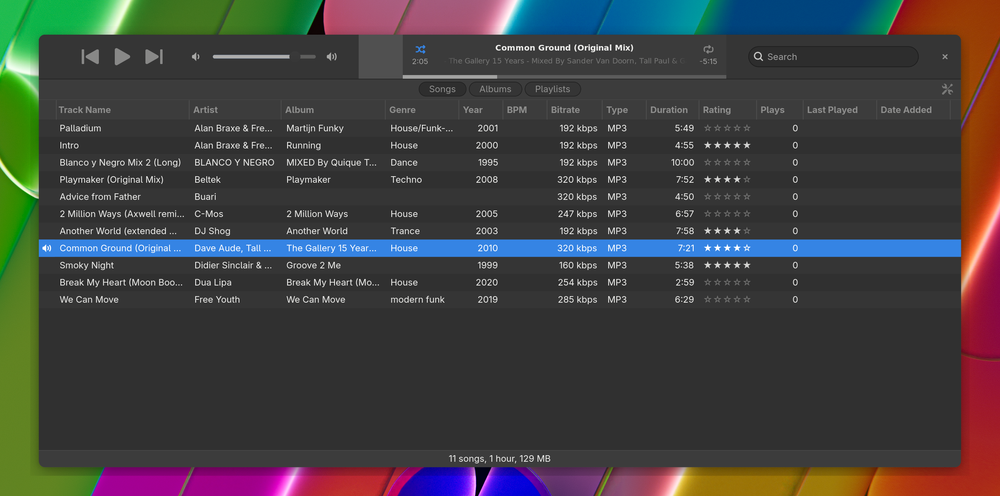

# Sustain




Open Sustain is a Linux music player heavily inspired by old iTunes builds.

> I was an Apple fanboy during the iTunes golden era (2005-2015).
> Each new release was a treat and what I still miss years after switching to Linux.
> Advent of solid LLM agents in late 2025 allowed me to get a substitute rolling.

This player is not an iTunes clone for a few reasons :
- each versions brought and took away good things, I'm cherry picking what I believe to be tasteful,
- bloat has not been ported,
- features for music lovers have been added.

This player is not designed by commity. 
It's autoritarian, as I believe was the case for most good Apple products.

The interface is working natively in both light and dark modes. 
It leverages natives features of Gnome to get the right blend of bespoke visual component without abusing GTK or bending Gnome.
For example native _icons_ are used, so are native _accent color_.

The library management has two modes, similar to what iTunes does :
- "Don't touch my files" (default), which only scans a designated library folder. In this mode, your audio files can only be "enhanced" by populating more ID.3 tags. They are never moved or re-organized.
- "Keep my library organized", which arranges and sorts the files cleanly by Artist and Album in the designated library folder. 

## Stack

The stack is Rust, GTK4, GStreamer, and SQLite. It should work on any linux distro. 
I'm striving for fast, safe and maintainable code.

## Features

Implemented:
- Playlists, Smart playlists, playlists folders

_probably_ coming later :
- Import from iTunes/Apple Music (.xml)
- Import from Rhythmbox
- BPM detection [drift from iTunes features]
- Key detection [drift from iTunes features]
- "Smart shuffle", using a local machine learning model [drift from iTunes features]
- Duplicates consolidation, to preserve the best audio version, but aggregate tags and attributes [drift from iTunes features]
- Artwork and ID.3 backfill, to consolidate a library with holes. [drift from iTunes features]
- Sync to Android [drift from iTunes features]
- [Export to XDJ](https://github.com/AnnoyingTechnology/rhythmbox-to-pioneer-xdj-exporter) [drift from iTunes features]
- Encode a CD
- Convert an existing library file to MP3 320 or Flac


## Key locations

- Config: `~/.config/sustain/settings.toml`
- Database: `~/.local/share/sustain/library.sqlite`

## Development

```sh
sudo apt install libgtk-4-dev libgstreamer1.0-dev libgstreamer-plugins-base1.0-dev

cargo run -p sustain-app
cargo test --workspace
cargo clippy --workspace --all-targets
```

### Sidenote

A longtime friend who stayed on macOS told me iTunes (now Apple Music) had "lost the plot" and that he'd love a version without all the junk. He told me the latest Apple Music puts the player at the bottom of the window. I didn't believe him, turns out it's true.
Apple has lost its way, but 2010-era Apple nailed music playback and I know what would improve on that. So there's probably room for a deshitified iTunes on macOS too.

## No Apple intellectual property

This project was written from scratch in Rust, against GTK4 and GStreamer. No Apple source code was read, decompiled, disassembled, or reverse-engineered in the making of Sustain. No Apple binaries, icons, fonts, artwork, sound effects, or localized strings are bundled or redistributed here. The visual and behavioral inspiration comes entirely from my memory and taste as a long-time iTunes user — i.e. from the publicly observable user experience of the application, which is not protected by copyright under EU law (cf. CJEU C-406/10, *SAS Institute v. World Programming*). Sustain is not affiliated with, endorsed by, or connected to Apple Inc. in any way. "iTunes" and "Apple Music" are trademarks of Apple Inc., referenced here only descriptively.