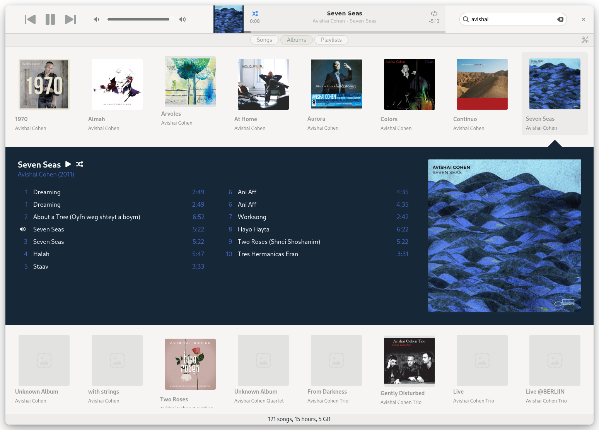

<h1>
  
  Sustain
</h1>




Sustain (`open-sustain/sustain`) is a Linux music player heavily inspired by old iTunes builds.

> I was an Apple fanboy during the iTunes golden era (2005-2015).
> Each new release was a treat and what I still miss years after switching to Linux.
> Advent of solid LLM agents in late 2025 allowed me to get a spiritual successor rolling.

This player is not pixel-perfect iTunes taxidermy for a few reasons :
- each versions brought and took away good things, I'm cherry picking what I believe to be tasteful,
- bloat has not been ported,
- features for music lovers have been added.

This player is not designed by commity. 
It's autoritarian, as I believe was the case for most good Apple products.

The interface respects both light and dark modes natively. It leverages GNOME's core features to strike the right balance of bespoke visual components without abusing GTK or fighting the desktop environment. For instance, it uses your native system icons and accent colors out of the box.

The library management has two modes, similar to what iTunes did :
- "Don't touch my files" (default), which only scans a designated library folder. In this mode, your audio files can only be "enhanced" by populating more ID.3 tags. They are never moved or re-organized.
- "Keep my library organized", which arranges and sorts the files cleanly by Artist and Album in the designated library folder. 

Managed-library organization can depend on hard links to move files without
copying file contents and without overwriting existing files. This is suitable
for normal local Linux filesystems such as ext4, XFS, Btrfs, and ZFS, but it can
fail on filesystems or mounts that do not support hard links, such as some SMB,
FUSE, FAT/exFAT, or restricted network shares. In those cases Sustain fails the
organization step rather than falling back to copy/delete.

## Stack

* Language: Rust (for speed, safety, and keeping the codebase maintainable)
* UI: GTK4 (integrated natively with GNOME)
* Audio Engine: GStreamer
* Database: SQLite

No Electron, no web wrappers. It’s built to be fast, lightweight, and play nice with pretty much any Linux distro.

## Features

See [docs/features.md](docs/features.md) for the full reference.

Implemented:
- Library management with two modes — "Don't touch my files" or "Keep my library organized" (*iso-iTunes*)
- Songs / Albums / Playlists views with a dense, keyboard-friendly table (*iso-iTunes*)
- Playlists, smart playlists, and playlist folders (*iso-iTunes*)
- Get Info multi-tab metadata editor with tag mirroring to ID3/Vorbis/MP4 (*iso-iTunes*)
- 5-star ratings, play count, skip count, last played, last skipped (*iso-iTunes*)
- Up Next queue with `Play Next` and `Add to Queue` (*iso-iTunes*)
- Real-time search, sortable and customizable columns (*iso-iTunes*)
- Remote artwork and metadata fetching via MusicBrainz, Cover Art Archive, and AcoustID (*iTunes-adjacent*)
- MPRIS / D-Bus / media-key integration (*Sustain-native*)
- Native light / dark theme and system accent color (*Sustain-native*)
- Single-instance enforcement per library database (*iso-iTunes*)

## Roadmap

- BPM and Key detection
- "Smart shuffle" powered by a local machine learning model
- Duplicates consolidation (preserve the best audio version, aggregate tags)
- Artwork and ID3 backfill
- Sync to Android / Export to [XDJ](https://github.com/AnnoyingTechnology/rhythmbox-to-pioneer-xdj-exporter)

## Key locations

- Config: `~/.config/sustain/settings.toml`
- Database: `~/.local/share/sustain/library.sqlite`

## Development

```sh
sudo apt install libgtk-4-dev libgstreamer1.0-dev libgstreamer-plugins-base1.0-dev

cargo run -p sustain-app
cargo test --workspace
cargo clippy --workspace --all-targets
```

### Sidenote

Apple has lost its way, but 2010-era Apple really nailed music playback. I just wanted to build on top of what made that era great. Honestly, seeing where Apple Music is today, there’s probably room for a deshitified iTunes on macOS, too.

## No Apple intellectual property

This project was written from scratch in Rust, against GTK4 and GStreamer. No Apple source code was read, decompiled, disassembled, or reverse-engineered in the making of Sustain. No Apple binaries, icons, fonts, artwork, sound effects, or localized strings are bundled or redistributed here. The visual and behavioral inspiration comes entirely from my memory and taste as a long-time iTunes user — i.e. from the publicly observable user experience of the application, which is not protected by copyright under EU law (cf. CJEU C-406/10, *SAS Institute v. World Programming*). Sustain is not affiliated with, endorsed by, or connected to Apple Inc. in any way. "iTunes" and "Apple Music" are trademarks of Apple Inc., referenced here only descriptively.
