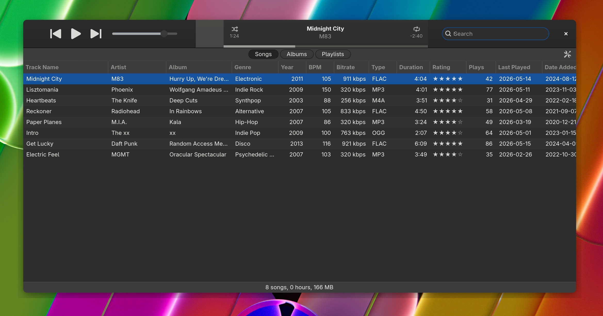

# xTunes



xTunes is a Linux music library/player.

xTunes is for a large local music library. It is for people who mostly want to
live in a sortable table, keep playlists on the side, rate tracks quickly, find
things fast, and press play without negotiating with the interface.

It is deliberately opinionated. The main view is the product: column layout,
row density, selection states, spacing, visual balance, and the hierarchy of
track title, artist, album, metadata, and playback state are treated as core
features.

It is designed to work visually in both dark and light mode. Contrast, tint,
chrome, table rows, and controls should be balanced in both themes, not tuned
for one and tolerated in the other.

It is openly inspired by iTunes from the early 2010s: compact chrome, a dense
library table, plain playlists, ratings, search, and predictable playback
controls. It is not trying to be a general media center.

It is not affiliated with Apple.

The target system is Debian on Wayland. The stack is Rust, GTK4, GStreamer, and
SQLite.

The project is early. The current work is mostly a real GTK interface scaffold
with mocked data and application boundaries. Playback, import, persistent
storage, metadata writing, and packaging are not wired yet.

No sync features are planned.

## Development

```sh
sudo apt install libgtk-4-dev libgstreamer1.0-dev libgstreamer-plugins-base1.0-dev

cargo run -p xtunes-app
cargo test --workspace
cargo clippy --workspace --all-targets
```
